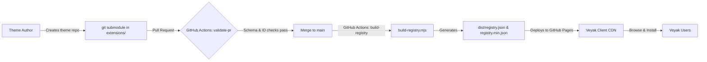

# 🎨 Veyak Themes Registry

[](https://github.com/iamdhakrey/veyak-themes/actions/workflows/validate-pr.yml)
[](https://github.com/iamdhakrey/veyak-themes/actions/workflows/build-registry.yml)
[](./extension.schema.json)
[](./LICENSE)

Central community theme registry, schema validator, and distribution pipeline for **[Veyak](https://github.com/iamdhakrey/veyak)** — the modern, next-generation API client.

This repository catalogs official and community-contributed themes. Themes added here are validated against strict JSON schemas and compiled into a centralized registry deployed to GitHub Pages for dynamic discovery and installation directly within the Veyak client.

---

## 📑 Table of Contents

- [How It Works](#-how-it-works)
- [Registry CDN Endpoints](#-registry-cdn-endpoints)
- [Theme Directory Structure](#-theme-directory-structure)
- [Theme Schema Specification](#-theme-schema-specification)
  - [Manifest Properties](#manifest-properties)
  - [UI Tokens](#ui-tokens)
  - [Syntax Highlighting Tokens](#syntax-highlighting-tokens)
- [How to Submit a Theme](#-how-to-submit-a-theme)
  - [1. Create Your Theme Repository](#1-create-your-theme-repository)
  - [2. Fork & Clone This Registry](#2-fork--clone-this-registry)
  - [3. Add Your Theme as a Submodule](#3-add-your-theme-as-a-submodule)
  - [4. Validate Your Theme Locally](#4-validate-your-theme-locally)
  - [5. Submit a Pull Request](#5-submit-a-pull-request)
- [Local Development](#-local-development)
- [CI/CD Automation](#-cicd-automation)
- [License](#-license)

---

## ⚙️ How It Works



1. **Submodule Architecture**: Each theme lives in its own independent Git repository and is linked into `extensions/<theme-id>/` as a Git submodule.
2. **Schema Validation**: Automated CI runs [Ajv](https://ajv.js.org/) against [`extension.schema.json`](./extension.schema.json) to verify hex colors, semantic naming, method badges, and folder name consistency.
3. **Automated Compilation**: On push to `main`, [`scripts/build-registry.mjs`](./scripts/build-registry.mjs) aggregates all themes with download links and embedded documentation into `dist/registry.json`.
4. **CDN Hosting**: The registry is published via GitHub Pages, enabling the Veyak application to fetch available themes in real-time.

---

## 🌐 Registry CDN Endpoints

The compiled registry is publicly accessible via GitHub Pages:

| Resource | URL | Description |
| :--- | :--- | :--- |
| **Full Registry** | `https://iamdhakrey.github.io/veyak-themes/registry.json` | Complete metadata, token definitions, and embedded README contents |
| **Minified Registry** | `https://iamdhakrey.github.io/veyak-themes/registry.min.json` | Production-optimized registry for client startup |
| **Theme Schema** | `https://themes.veyak.iamdhakrey.dev/schemas/themes/1.0.0.json` | JSON Schema (Draft 2020-12) for IDE validation & linting |

---

## 📁 Theme Directory Structure

Themes inside this repository are housed under `extensions/`:

```text
veyak-themes/
├── .github/
│   └── workflows/
│       ├── build-registry.yml      # Builds & deploys registry to GitHub Pages
│       └── validate-pr.yml         # Validates submodules on PR
├── extension.schema.json           # JSON Schema definition (Draft 2020-12)
├── extensions/
│   └── <theme-id>/                 # Git submodule (must match theme.id)
│       ├── theme.json              # Required: Theme manifest and design tokens
│       ├── README.md               # Recommended: Documentation & screenshots
│       └── screenshot.png          # Optional: Gallery preview thumbnail
├── scripts/
│   ├── build-registry.mjs          # Registry bundle generator
│   └── validate.mjs                # Ajv schema validator
└── package.json
```

---

## 📋 Theme Schema Specification

Every theme must provide a valid `theme.json` in the root of its repository.

### Sample `theme.json`

```json
{
  "$schema": "https://themes.veyak.iamdhakrey.dev/schemas/themes/1.0.0.json",
  "id": "github-dark",
  "name": "GitHub Dark",
  "version": "1.0.0",
  "description": "Official GitHub Dark palette for Veyak",
  "author": "GitHub",
  "repository": "https://github.com/iamdhakrey/veyak-github-dark-theme",
  "license": "MIT",
  "tags": ["github", "dark", "minimal"],
  "variant": "dark",
  "isBuiltin": false,
  "tokens": {
    "ui": {
      "colorBg": "#0D1117",
      "colorPanel": "#161B22",
      "colorPanelRaised": "#21262D",
      "colorBorder": "#30363D",
      "colorBorderMuted": "#21262D",
      "colorTextPrimary": "#C9D1D9",
      "colorTextSecondary": "#8B949E",
      "colorTextMuted": "#484F58",
      "colorPrimary": "#1F6FEB",
      "colorPrimaryHover": "#388BFD",
      "colorSecondary": "#238636",
      "colorSuccess": "#238636",
      "colorError": "#F85149",
      "colorWarning": "#D29922",
      "methodGet": "#2EA043",
      "methodPost": "#1F6FEB",
      "methodPut": "#D29922",
      "methodPatch": "#A371F7",
      "methodDelete": "#F85149",
      "methodWs": "#A371F7",
      "methodQuery": "#58A6FF",
      "methodGrpc": "#38BDF8",
      "methodGraphql": "#DB61A2",
      "radiusMd": "6px",
      "radiusLg": "8px"
    },
    "syntax": {
      "keyword": "#FF7B72",
      "string": "#A5D6FF",
      "comment": "#8B949E",
      "property": "#79C0FF",
      "punctuation": "#C9D1D9",
      "operator": "#79C0FF",
      "number": "#79C0FF",
      "boolean": "#FF7B72",
      "null": "#FF7B72",
      "function": "#D2A8FF",
      "variable": "#FFA657",
      "attribute": "#79C0FF",
      "className": "#FFA657"
    }
  }
}
```

### Manifest Properties

| Property | Type | Description |
| :--- | :--- | :--- |
| `$schema` | `string` (URI) | Must be `https://themes.veyak.iamdhakrey.dev/schemas/themes/1.0.0.json` (or valid schema URI) |
| `id` | `string` | Unique kebab-case ID (e.g. `dracula-dark`). **Must match the folder name** under `extensions/` |
| `name` | `string` | Display name (2-50 characters) |
| `version` | `string` | Semantic version string (e.g., `1.0.0`) |
| `description` | `string` | Brief description of the theme (max 280 chars) |
| `author` | `string` | Theme creator name or organization |
| `repository` | `string` (URI) | URL to the theme's source repository |
| `license` | `string` | SPDX license identifier: `"MIT"`, `"Apache-2.0"`, `"GPL-3.0"`, `"BSD-3-Clause"`, `"ISC"`, or `"Unlicense"` |
| `tags` | `string[]` | Array of up to 8 kebab-case tags (e.g., `["dark", "neon", "contrast"]`) |
| `variant` | `string` | `"dark"` or `"light"` |
| `isBuiltin` | `boolean` | `false` for community themes (default: `false`) |
| `screenshot` | `string` (optional) | Relative path to thumbnail image |
| `tokens` | `object` | Contains `ui` and `syntax` token maps |

### UI Tokens

All color tokens must be valid 6-character (`#RRGGBB`) or 8-character (`#RRGGBBAA`) hex values. Radii must be in `px` or `rem`.

- **Surfaces & Layers**: `colorBg`, `colorPanel`, `colorPanelRaised`
- **Borders**: `colorBorder`, `colorBorderMuted`
- **Typography**: `colorTextPrimary`, `colorTextSecondary`, `colorTextMuted`
- **Brand & Accents**: `colorPrimary`, `colorPrimaryHover`, `colorSecondary`, `colorSuccess`, `colorError`, `colorWarning`
- **HTTP / Protocol Method Badges**: `methodGet`, `methodPost`, `methodPut`, `methodDelete`, `methodPatch`, `methodQuery`, `methodWs`, `methodGrpc`, `methodGraphql`
- **Geometry**: `radiusMd`, `radiusLg`

### Syntax Highlighting Tokens

Used for JSON payloads, GraphQL queries, code editors, and response previews:

`keyword`, `string`, `comment`, `property`, `punctuation`, `operator`, `number`, `boolean`, `null`, `function`, `variable`, `attribute`, `className`

---

## 🚀 How to Submit a Theme

### 1. Create Your Theme Repository

1. Create a new public repository on GitHub (e.g., `https://github.com/<your-username>/veyak-my-theme`).
2. Add a `theme.json` file in the root following the [Theme Schema Specification](#-theme-schema-specification).
3. (Recommended) Add a `README.md` and preview screenshot.

### 2. Fork & Clone This Registry

```bash
git clone --recurse-submodules https://github.com/iamdhakrey/veyak-themes.git
cd veyak-themes
```

### 3. Add Your Theme as a Submodule

The submodule path under `extensions/` must match the `id` defined in your `theme.json`:

```bash
# git submodule add <repository-url> extensions/<theme-id>
git submodule add https://github.com/<your-username>/veyak-my-theme extensions/my-theme
```

### 4. Validate Your Theme Locally

Install dependencies and execute the validation script:

```bash
npm install
npm run validate
```

If validation succeeds, you will see:
```text
✅ [my-theme]: Valid theme manifest
```

Test generating the registry bundle:

```bash
npm run build
```

### 5. Submit a Pull Request

1. Commit `.gitmodules` and `extensions/<theme-id>`:
   ```bash
   git add .gitmodules extensions/my-theme
   git commit -m "feat(themes): add my-theme"
   git push origin <your-branch>
   ```
2. Open a Pull Request against `main`.
3. The CI validation workflow will run automatically to verify the schema. Once approved and merged, the registry will be rebuilt and published!

---

## 🛠️ Local Development

### Prerequisites

- **Node.js**: `>= 20.0.0`
- **npm** or **bun**

### Available Scripts

| Command | Description |
| :--- | :--- |
| `npm run validate` | Runs Ajv schema validation on all theme manifests in `extensions/` |
| `npm run build` | Compiles `dist/registry.json` and `dist/registry.min.json` |
| `npm test` | Alias for `npm run validate` |

---

## 🤖 CI/CD Automation

- **PR Validation ([`validate-pr.yml`](./.github/workflows/validate-pr.yml))**:
  Automatically triggered on pull requests affecting `extensions/**`, `.gitmodules`, or `extension.schema.json`. Checks that submodules are cloneable, JSON syntax is valid, folder names match IDs, and manifests strictly adhere to the schema.
- **Registry Deployment ([`build-registry.yml`](./.github/workflows/build-registry.yml))**:
  Runs on every push to `main`. Clones all submodules recursively, executes `scripts/build-registry.mjs`, and publishes `dist/` to the `gh-pages` branch.

---

## 📄 License

This repository and pipeline are licensed under the [MIT License](./package.json). Individual themes maintain their respective open-source licenses as declared in their `theme.json` manifests.
